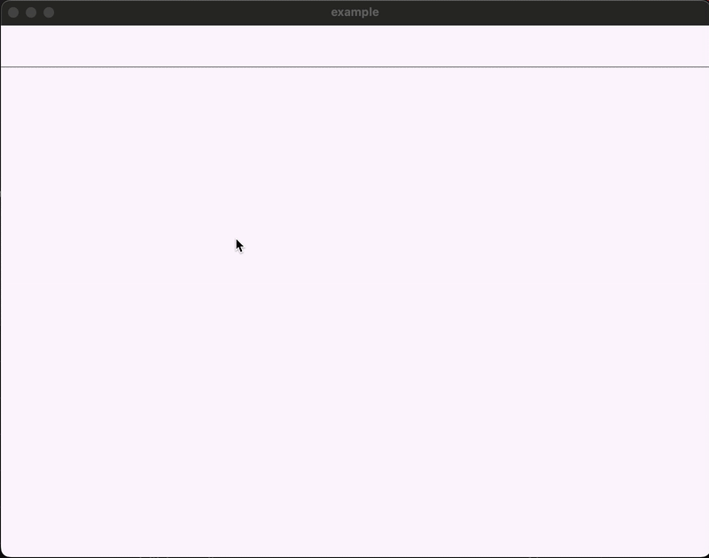

# smart_date_field_picker 📅

A customizable and accessible date field picker widget for Flutter. `SmartDateFieldPicker` seamlessly 
integrates with `TextFormField`, providing a rich calendar overlay with keyboard navigation, 
focus handling, and support for dynamic date ranges and appearance customization.

---



---
## Features

- Easy integration with `TextFormField`
- Overlay calendar view with month & year picker support
- Fully navigable using keyboard (arrow keys, enter, tab)
- Works with `OverlayPortalController` for dynamic show/hide control
- Highly customizable UI with `PickerDecoration`
- Supports min and max date boundaries (`firstDate`, `lastDate`)

---

## Installation

1. Add the latest version to your `pubspec.yaml`:

```yaml
dependencies:
  smart_date_field_picker: latest_version
```

2. Import the package:

```dart
import 'package:smart_date_field_picker/smart_date_field_picker.dart';
```

---

## Example usage

### Basic SmartDateFieldPicker

Use `OverlayPortalController` to control the calendar dropdown programmatically:

```dart
final OverlayPortalController controller = OverlayPortalController();
DateTime selectedDate = DateTime.now();
```

```dart
SmartDateFieldPicker(
  initialDate: selectedDate,
  firstDate: DateTime(2020, 1, 1),
  lastDate: DateTime(2030, 12, 31),
  controller: controller,
  decoration: const InputDecoration(
    labelText: 'Pick a date',
    border: OutlineInputBorder(),
  ),
  onDateSelected: (value) {
    setState(() {
      selectedDate = value ?? DateTime.now();
    });
  },
),
```

---

### Calendar Navigation Keys

| Key Combination        | Action                                        |
|------------------------|-----------------------------------------------|
| `←`, `→`               | Move left or right by 1 day                   |
| `↑`, `↓`               | Move up/down by 1 week                        |
| `Enter`                | Select focused date / Navigate arrows         |
| `Tab`, `Shift + Tab`   | Move focus between month, arrows, and dates   |

---

## Customization via PickerDecoration

You can customize the appearance using the `PickerDecoration` and nested decorators:

```dart
PickerDecoration(
  width: 300,
  height: 350,
  textStyle: TextStyle(color: Colors.black),
  headerDecoration: HeaderDecoration(
    headerTextStyle: TextStyle(color: Colors.white),
    focusTextStyle: TextStyle(color: Colors.amber),
    iconDecoration: IconDecoration(
      leftIcon: Icons.arrow_back_ios,
      rightIcon: Icons.arrow_forward_ios,
    ),
  ),
  dayDecoration: DayDecoration(
    selectedDecoration: BoxDecoration(
      color: Colors.deepPurple,
      borderRadius: BorderRadius.circular(6),
    ),
  ),
)
```

---

## Advanced Focus and Overlay Support

The calendar uses `FocusNode`s to support keyboard navigation and focus cycling. You can access `focusSelectedDate` and programmatically control focus or highlight.

---

## Properties

| Property              | Type                          | Description                                                  |
|-----------------------|-------------------------------|--------------------------------------------------------------|
| `initialDate`         | `DateTime`                    | The initially selected date                                  |
| `firstDate`           | `DateTime?`                   | The earliest date that can be selected                       |
| `lastDate`            | `DateTime?`                   | The latest date that can be selected                         |
| `controller`          | `OverlayPortalController`     | Controller for toggling overlay visibility                   |
| `decoration`          | `InputDecoration`             | Decoration for the input field                               |
| `pickerDecoration`    | `PickerDecoration?`           | Theme customization for calendar UI                          |
| `onDateSelected`      | `void Function(DateTime?)`    | Callback when a date is selected                             |
| `textController`      | `TextEditingController`       | Controller for managing text manually                        |
| `dropdownOffset`      | `Offset?`                     | Customize dropdown placement                                 |
| `layerLink`           | `LayerLink`                   | Used for overlay positioning                                 |
| `renderBox`           | `RenderBox?`                  | Optional: To help compute overlay position dynamically       |

---
